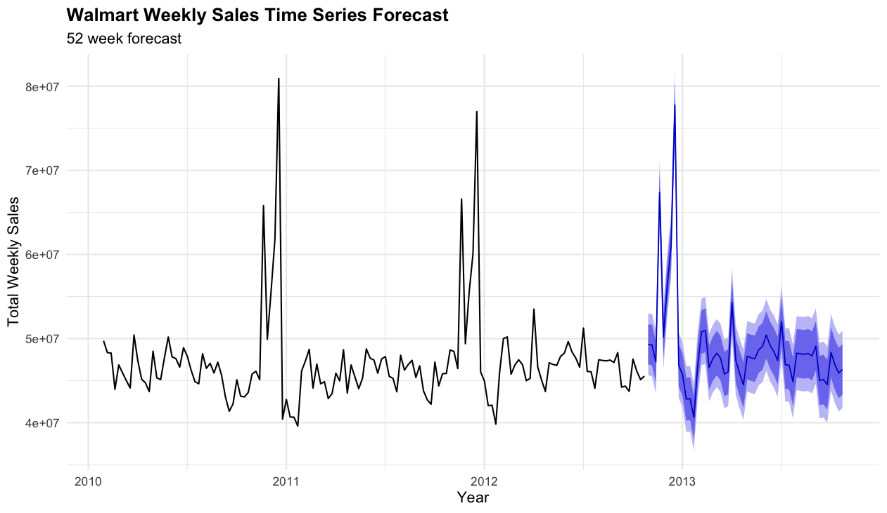
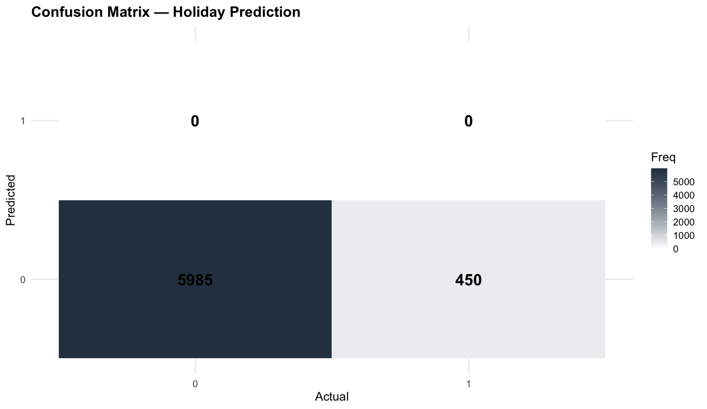

# Walmart Weekly Sales: ARIMA Forecasting and Holiday Effect Analysis in R

## Overview
A time series project on 45 Walmart stores that fits an ARIMA model to forecast aggregate weekly sales 52 weeks forward, then tests whether the dataset's holiday flag actually explains sales variation using ANOVA and logistic regression.

The forecasting model performs well. The holiday analysis produced a statistically significant but practically negligible result, and investigating why turned out to be the most useful part of the project.

## Dataset
Walmart sales records covering **6,435 store-weeks**: 45 individual stores observed across 143 weekly periods from February 5, 2010 through October 26, 2012.

| Column | Type | Description |
|---|---|---|
| `Store` | Categorical | Store identifier, 1 through 45 |
| `Date` | Date | Week ending date, 7 day increments |
| `Weekly_Sales` | Numerical | Sales for that store that week |
| `Holiday_Flag` | Categorical | 1 if the week contains a designated holiday, 0 otherwise |
| `Temperature` | Numerical | Regional temperature, -2.1 to 100.1 °F |
| `Fuel_Price` | Numerical | Regional fuel cost, $2.47 to $4.47 |
| `CPI` | Numerical | Consumer price index, 126.1 to 227.2 |
| `Unemployment` | Numerical | Regional unemployment rate, 3.9% to 14.3% |

Holiday weeks make up **450 of 6,435 observations (6.99%)**, a class imbalance that becomes central to the classification results below.

## Part 1: Time Series Forecasting

Store-level sales were aggregated by date into a single national weekly series, converted to a `ts` object at weekly frequency, and fitted with `auto.arima()`. The fitted model was then projected 52 weeks forward.

The black line is observed history, the blue line is the forecast, and the shaded bands are 80 percent and 95 percent prediction intervals.

Baseline sales hold steady between roughly $44M and $50M per week across the full observation window, with no meaningful long-term trend in either direction. Two dramatic spikes appear at the end of 2010 and 2011, reaching $80.9M and $77.0M respectively — close to double the baseline. The model successfully learned this annual seasonality and projects the same spike pattern into late 2013.

The prediction intervals widen noticeably as the horizon extends, which is expected behavior: uncertainty compounds the further out a forecast reaches.

### Model Accuracy

| Metric | Value | Interpretation |
|---|---|---|
| ME (Mean Error) | 156,222.8 | Slight over-prediction, about $156K per week |
| RMSE | 1,453,726 | Typical error around $1.45M per week, roughly 3% of weekly volume |
| MAE | 820,012.5 | Average absolute error of $820K per week |
| MPE | 0.339% | Negligible directional bias |

MAE sitting well below RMSE is informative: RMSE penalizes large errors quadratically, so the gap indicates that a small number of weeks — almost certainly the holiday spikes — account for a disproportionate share of total error. The model tracks ordinary weeks closely and struggles mainly at the extremes.

At roughly 3% error against $40M to $50M weekly volume, this is acceptable accuracy for retail forecasting.

## Part 2: ANOVA — Does the Holiday Flag Predict Sales?

H₀: Mean weekly sales are equal for holiday and non-holiday weeks
H₁: Mean weekly sales differ between the two groups

| Source | Df | Sum Sq | Mean Sq | F | p |
|---|---|---|---|---|---|
| Holiday Flag | 1 | 2.789e+12 | 2.789e+12 | 8.767 | 0.00308 |
| Residuals | 6,433 | 2.047e+15 | 3.181e+11 | | |

**p = 0.00308 < α = 0.05, so H₀ is rejected.** There is a statistically significant difference in weekly sales between holiday and non-holiday weeks.

**However, the effect size is very small.** Holiday Flag accounts for only **0.14 percent** of the total variance in weekly sales (η² = SS_holiday / SS_total = 2.789e12 / 2.050e15). In store-level terms, holiday weeks average $1,122,888 against $1,041,256 for non-holiday weeks — a difference of about **7.8 percent**, not the doubling the forecast chart's spikes might suggest.

The significance is real but is driven largely by sample size. With n = 6,435, even a small mean difference clears the significance threshold. Statistical significance and practical importance are separate questions here, and this result satisfies the first without satisfying the second.

## Part 3: Logistic Regression — Predicting Holiday Weeks

A binary logistic regression was fit using Weekly Sales and CPI as predictors of Holiday Flag.

| Predictor | Estimate | Std. Error | z | p |
|---|---|---|---|---|
| (Intercept) | -2.862e+00 | 2.440e-01 | -11.726 | < 2e-16 |
| Weekly Sales | 2.470e-07 | 8.372e-08 | 2.950 | 0.00318 |
| CPI | 3.889e-05 | 1.248e-03 | 0.031 | 0.97514 |

| Model statistic | Value |
|---|---|
| Null deviance | 3262.0 (df = 6434) |
| Residual deviance | 3253.5 (df = 6432) |
| AIC | 3259.5 |

Weekly Sales is statistically significant (p = 0.00318), while CPI contributes essentially nothing (p = 0.975). CPI tracks slow-moving inflation and does not vary meaningfully between holiday and non-holiday weeks, so this is unsurprising.

The deviance reduction tells the real story: adding both predictors moves deviance from 3262.0 to 3253.5, a drop of just **8.5 points across two degrees of freedom**. The model explains almost none of the variation in Holiday Flag.

### Confusion Matrix

| Metric | Value |
|---|---|
| Accuracy | 0.9301 (93.01%) |
| 95% CI | (0.9236, 0.9362) |
| P-Value (Acc > NIR) | 0.5125 |
| McNemar's Test | < 2e-16 |
| Sensitivity | 1.0000 (100%) |
| Specificity | 0.0000 (0%) |

**The 93.01 percent accuracy is entirely misleading.** The model predicted non-holiday for all 6,435 observations and never once classified a week as a holiday. The top row of the matrix is empty: 0 and 0.

Sensitivity of 100 percent reflects perfect identification of the majority class. Specificity of 0 percent confirms the model detected none of the 450 actual holiday weeks. Because 93.01 percent of weeks are non-holidays, always guessing non-holiday is correct 93 percent of the time without learning anything — and the p-value of 0.5125 against the No Information Rate confirms the model offers no improvement over that trivial strategy.

This is a textbook demonstration of why accuracy is a poor metric under class imbalance.

## Key Finding: The Holiday Flag Does Not Mark the Sales Spikes

Investigating why the holiday signal was so weak surfaced the most interesting result in this project.

Checking the highest-selling weeks against their holiday flags:

| Week | Total Sales | Holiday Flag |
|---|---|---|
| 2010-12-24 | $80.9M | **0** |
| 2011-12-23 | $77.0M | **0** |
| 2011-11-25 | $66.6M | 1 |
| 2010-11-26 | $65.8M | 1 |

**The two tallest spikes in the entire series are not flagged as holidays.** They are the pre-Christmas shopping weeks. The flag marks the week containing the holiday itself, which for Christmas falls on December 31 and December 30 — *after* the shopping surge has ended.

Breaking down all 10 flagged holiday weeks against the $46.9M non-holiday baseline:

| Flagged week | Total Sales | vs baseline |
|---|---|---|
| 2010-11-26 (Thanksgiving) | $65.8M | +40.5% |
| 2011-11-25 (Thanksgiving) | $66.6M | +42.1% |
| 2012-02-10 (Super Bowl) | $50.0M | +6.7% |
| 2010-02-12 (Super Bowl) | $48.3M | +3.2% |
| 2012-09-07 (Labor Day) | $48.3M | +3.1% |
| 2011-02-11 (Super Bowl) | $47.3M | +1.0% |
| 2011-09-09 (Labor Day) | $46.8M | -0.2% |
| 2011-12-30 (Christmas) | $46.0M | -1.7% |
| 2010-09-10 (Labor Day) | $45.6M | -2.6% |
| 2010-12-31 (Christmas) | $40.4M | **-13.7%** |

Only Thanksgiving shows a substantial lift. Super Bowl and Labor Day sit essentially at baseline, and both flagged Christmas weeks fall **below** it — the December 31, 2010 week is 13.7 percent under the non-holiday average.

This single finding explains all three weak results simultaneously: the ANOVA effect size of 0.14 percent, the 8.5 point deviance reduction, and the classifier's total failure to detect holidays. The flag is not a broken variable, it simply measures calendar holidays rather than retail seasonality, and in this dataset those are largely different weeks.

## Conclusion

The ARIMA model performs well, achieving roughly 3 percent error against weekly volume and correctly reproducing the annual seasonal pattern in its 52-week projection. Aggregate weekly sales are stable between $40M and $50M with strong, repeating year-end seasonality and no long-term trend.

The holiday classification work returned a statistically significant but practically negligible relationship, and the classifier collapsed entirely to majority-class prediction under 93 percent class imbalance.

The reason is that the holiday flag marks calendar holiday dates rather than the shopping surges surrounding them. The two largest sales weeks in the dataset are unflagged, and both flagged Christmas weeks fall below the non-holiday baseline. A flag defined as "the two weeks preceding a major holiday" would almost certainly produce a far stronger signal.

Practical next steps would be constructing a pre-holiday indicator variable, adding the unused predictors (Temperature, Fuel Price, Unemployment), and applying class balancing through threshold adjustment or SMOTE oversampling.

## Limitations

**Weekly frequency is approximate.** The series was declared with `frequency = 52`, but a calendar year contains about 52.18 weeks. Over a three-year window this introduces small drift between the model's seasonal index and the actual calendar position of holidays.

**ANOVA on store-level rather than aggregated data.** The test ran across all 6,435 store-weeks, where between-store size differences dominate the residual variance. This inflates the denominator and suppresses the apparent holiday effect. Running the same test on the 143 aggregated weekly totals would isolate the holiday effect more cleanly, at the cost of a much smaller sample.

**Short training window.** The model was fit on under three years of data, giving it only two complete observations of the annual holiday cycle from which to learn seasonality.

**Unused predictors.** Temperature, Fuel Price, and Unemployment are all present in the dataset but were not incorporated into either model.

## Methods and Tools
Analysis performed in **R** using `tidyverse`, `dplyr`, `forecast`, `ggplot2`, and `caret`.

Techniques applied:
- Date parsing with `as.Date(format = "%d-%m-%Y")` to handle day-first date strings
- Aggregation of 45 store series into a single national weekly total via `group_by()` and `summarize()`
- Time series construction with `ts(start = c(2010, 5), frequency = 52)`
- Automated ARIMA order selection with `auto.arima()`
- 52-week ahead forecasting with `forecast(h = 52)` and visualization via `autoplot()` with prediction intervals
- Model evaluation with `accuracy()` reporting ME, RMSE, MAE, and MPE
- One-way ANOVA with `aov()` testing weekly sales against holiday flag
- Binary logistic regression with `glm(family = "binomial")`
- Classification at a 0.5 probability threshold and evaluation via `caret::confusionMatrix()`
- Confusion matrix visualization as a `geom_tile()` heatmap

## Reference
Walmart Sales Dataset. Kaggle.
